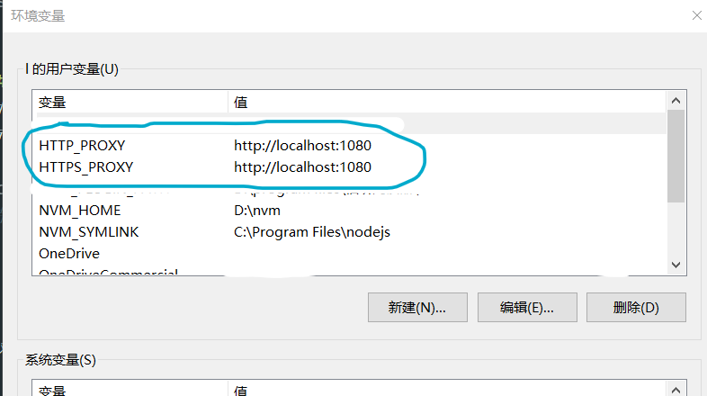

# #======youget

```
you-get -o "C:\Users\break\Desktop\局域网共享" "https://www.youtube.com/watch?v=2nJ1tIcknZc" --playlist


you-get -o D:\p "https://www.youtube.com/watch?v=30qnU7embHU&list=RDCMUCODmLwTsX0tlp7LvMeag4AA&index=6" 

--debug


--skip-existing-file-size-check

--playlist
```


# #======conda

```bash
conda info --env 列出所有环境名字

conda create -n tf python==3.7 创建环境

conda remove -n tf 删除环境

activate tf 激活环境

conda list 查看当前环境的安装包有哪些

conda deactivate 注销当前环境

conda env list 查看环境所在路径
```


# #======github

## ##----------------基本操作

```bash
设置用户名和邮箱，--global一次操作。永久生效

git config --global user.name "用户名"

git config --global user.email "邮箱"


tip：git全局配置文件：C:/Users/用户名文件夹/.gitconfig

查看所有全局配置项：git config --list --global

查看指定配置项：git config user.name


浏览器打开帮助手册：git help config 

精简终端手册：git  config -h
```

## ##----------------本地仓库

```bash
项目文件夹根目录下：

初始化仓库，生成.git隐藏文件夹： git init 

检查文件状态，红色字体，untracked是未跟踪的文件：git status；精简显示，红色问号表示未跟踪： git status -s 或 git status --short

跟踪文件（暂存区），绿色字体显示（检查文件状态），绿色大写A（精简状态显示），表示跟踪成功： git add 文件名

提交到本地仓库： git commit -m "本次提交的信息，提交者自由书写"
修改当前本地仓库的提示信息： git commit --amend
tip ：红色字体，M表示已跟踪且被提交到本地仓库 的文件，工作区的该文件被修改了


已修改已跟踪的文件放到暂存区： git add 已修改文件

再次提交： git commit -m "..."


!危险操作：将本地仓库的文件覆盖工作区的文件： git checkout -- 文件名


一次性暂存多个新增和修改的文件： git add .
在 commit（提交）之前撤销 git add . 运行  git reset <file>  或  git reset 取消所有更改即可。


取消暂存区的文件： git reset HEAD 要取消的文件


一次性提交到本地仓库： git commit -a -m "描述信息"
修改当前本地仓库的提示信息： git commit --amend


仓库和工作区移除文件： git rm -f 文件名
仓库移除，工作区保留： git rm --cached 文件名
移除后需要重新提交到仓库才能实现更改：git commit -m "移除本仓某些文件"


```

## ##----------------版本回退切换

```bash
查看提交历史：
git log；
查看两行：git log -2；
一行展示：git log -2 --pretty=oneline

%h CommitID简写哈希 | %an作者名字 | %ar作者修订日期 | %s提交说明:  
git log -2 --pretty=format:"%h | %an | %ar | %s"


一行展示所有提交历史：
git log -- pretty=oneline

回退到指定版本：
git reset --hard CommitID

旧版本中查看所有提交历史：git reflog --pretty=oneline
```


## ##----------------配置ssh key,添加关联

```bash
生成公钥私钥，私钥id_rsa，公钥id_rsa.pub：
ssh-keygen -t rsa -b 4096 -C "github注册时的邮箱"

在 C:\Users\用户名文件夹\.ssh 目录中生成 id_rsa 和 id_rsa.pub 两个文件

验证是否成功：
ssh -T git@github.com

本地仓库与远程仓库关联：在github上生成一个新的仓库，按页面提示操作即可

1.查看当前关联：
git remote -v

删除关联：
git remote remove 步骤1中查到的名字，如origin

添加关联：
git remote add origin 远仓ssh地址

修改关联：
git remote set-url origin 远仓ssh地址

克隆远程仓库到本地：
git clone 仓库地址(ssh方式：有push权限。 http方式：无push权限)
```


## ##----------------git分支branch

```bash
查看所有分支：
git branch

创建分支：
git branch 分支名

切换分支：
git checkout 分支名
tip:切换分支的时候，新分支的内容将与现在你看到的文件夹下（即工作区）的文件合并，而不是全盘替换

创建切换分支：
git checkout -b 分支名

主分支改名为main ：
git branch -M main 

合并分支：
先切换到master主分支：
git checkout master
合并：
git merge login


删除分支：
git branch -d 分支名


合并时遇到冲突：
vscode打开冲突的文件，根据提示修改
git add . 
git commit -m "解决分支合并冲突"

创建推送远程分支：
第一次（带-u）将本地分支和远程仓库关联：
git push -u 远程仓别名 本地分支名:远程分支名（可省略）；
简化，分支名相同：
git push -u 远仓别名 本地分支名


推送master主支，同时会和远仓合并：
git push
http.postBuffer默认上限为1M所致。在git的配置里将http.postBuffer变量改大一些即可，比如将上限设为500M：
git config --global http.postBuffer 524288000


查看远程仓所有分支：
git remote show 远仓名
跟踪分支，将远仓分支弄到本地：
git checkout 远仓分支名；
本地分支重命名：
git checkout -b 本地重命名 远仓名/远仓分支名
拉取当前所在分支最新版本，同时会合并工作区，本地仓：
git pull
删除远程分支：
git push 远仓名 --delete 远仓分支名


```

创建远程分支：

```bash
git branch -vv 查看本地远程的对应
git checkout -b my-test（本分仓命名）  //在当前分支下创建并切换my-test的本地分支分支

创建远分仓：
git push -u origin my-test(本分仓名):my-test(远分仓命名)  //将my-test分支推送到远程,-u表示第一次，远分仓创建成功，本分仓将自动关联远分仓
git push -u origin my-test(本远分仓同名)  本远起同一个名字可省略远分仓命名参数。tip：创建远分仓因网络原因，多试几次

推送本分仓代码：
git push origin my-test(本地名) //本地分支已经与远支建立联系，日常写代码可用该命令push，或者就在当前分支仓下，git push

手动更改本分仓和远分仓的关联：
git branch --set-upstream-to=origin/my-test(远程) my-test(本地) //手动关联本地分支my-test关联到远程分支my-test上   
git branch -a //查看所有远程分支 
```

创建空分支：

```bash
git checkout --orphan 分支名
修改.gitignore文件
创建完之后需要commit才能看到分支
```


在新文件夹下创建远程分支：若工作区gitignore文件过多，切换分支时工作区太混乱，可在一个新的文件夹创建新的分支来处理

<font color=00FFFF>.gitnore忽略文件过多的情况下，建议本地不要把所有分支都放到一个文件夹，切换分支时容易混乱</font>

```bash
git init
git remote add origin 代码仓库地址
git pull origin 远仓分支名
git branch -M 重命名本地分支名
```


## ##----------------.gitignore文件

```bash
创建文件：touch .gitignore

.gitignore规则不生效的原因参考:
.gitignore只能忽略那些原来没有被track的文件，如果某些文件已经被纳入了版本管理中，则修改.gitignore是无效的。所以一定要养成在项目开始就创建.gitignore文件的习惯。

解决方法就是先把本地缓存删除(改变成未track状态)，然后再提交：

git rm -r --cached .

git add .

git commit -m "msg"


```

文件书写语法格式

```
文件 .gitignore 的格式规范如下：
① 以 #开头的是注释
② 以 / 结尾的是目录
③ 以 / 开头防止递归
④ 以 ! 开头表示取反
⑤ 可以使用 glob 模式进行文件和文件夹的匹配（glob 指简化了的正则表达式）
```

global模式

```
① 星号 * 匹配零个或多个任意字符
② [abc] 匹配任何一个列在方括号中的字符 （此案例匹配一个 a 或匹配一个 b 或匹配一个 c） ③ 问号 ? 只匹配一个任意字符
④ 在方括号中使用短划线分隔两个字符， 表示所有在这两个字符范围内的都可以匹配（比如 [0-9] 表示匹配
所有 0 到 9 的数字）
⑤ 两个星号 ** 表示匹配任意中间目录（比如 a/**/z 可以匹配 a/z 、 a/b/z 或 a/b/c/z 等）
```

示范

|

 ## ##----------------奇淫巧技：

### ###--------------------查询相关

```bash
查看最近一次具体文件修改：
git log -n 1 --stat
```

<font color=green>查看当前仓库主支或分支的文件都有哪些：打开git ui，打开仓库，菜单栏repository下拉，browse相关选项可查看</font>


### ###--------------------删除相关，减少仓库历史版本，减少本地存储

保留大量的历史版本会给存储设施增加负荷，有时候我们需要删除之前的所有历史版本与log，仅保留当前版本的文件。

删除master分支下的所有历史版本与log，只保留当前的版本，并同步至GitHub

2. 方法一

先新建一个名为latest_branch的分支，然后将当前master分支中的所有文件添加到latest_branch分支中，接着等待移动完毕后删除master分支，最后把latest_branch这个分支的分支名改为master。

以下是具体实现：

```bash
2.1. 切换到latest_branch分支下

git checkout --orphan latest_branch

2.2. 添加所有文件，该命令添加当前项目文件夹下的，即工作区的所有文件，包括被ignore的文件

git add -A

2.3. 提交更改

git commit -am "清除所有历史版本以减少仓库大小，请重新从远程拷贝此仓库"

2.4. 删除分支

git branch -D master

2.5. 将当前分支重命名

git branch -m master

2.6. 最后，强制更新存储库

git push -f origin master

2.7. 技巧

将如下代码保存在一个bat文件里，然后双击运行即可。

git checkout --orphan latest_branch

git add -A

git commit -am "清除所有历史版本以减少仓库大小，请重新从远程拷贝此仓库"

git branch -D master

git branch -m master

git push -f origin master
```


3. 方法二

不推荐使用，可能导致git存储库出现问题。思路：直接删除.git文件再初始化仓库。

```bash
3.1. 先删除.git文件夹

3.2. 然后初始化Git（user为你的用户名，repo为你的仓库名）

git init git remote add origin git@github.com:user/repo

3.3. 提交当前版本的代码

git add * git commit -am 'message'

最后，强制更新到GitHub：

git push -f origin master
```

————————————————

版权声明：本文为CSDN博主「COCO56」的原创文章，遵循CC 4.0 BY-SA版权协议，转载请附上原文出处链接及本声明。

原文链接：https://blog.csdn.net/COCO56/article/details/95109142


### ###--------------------修改相关

tip：以下命令可用于修改远仓的部分文件

在我们的项目中，经常会在本地编译一些代码，还未写完，测试那边来告诉你要改改某个文件的bug，非常着急，此时改完了，提交的时候，自己还在编译的代码并不想提交，此时，你可以利用git这些指令帮助你！

```bash
1/ git status -s 查看仓库状态

2/ git add src/components/文件名 添加需要提交的文件名（加路径--参考git status 打印出来的文件路径）

3/ git stash -u -k 忽略其他文件，把现修改的隐藏起来，这样提交的时候就不会提交未被add的文件

4/ git commit -m "哪里做了修改可写入..."

#灵活根据命令行提示处理

5/ git pull 拉取合并； git pull origin main   远仓origin ，分支：主分支main ；  

6/ git push 推送到远程仓库；或：git push --set-upstream origin main；强制推送：git push -f origin master

7/ git stash pop 恢复之前忽略的文件（非常重要的一步）
```

<font color=gree>tip: 5/ git pull 命令可用于从远仓拉取最新代码，并合并，同时提交到本地仓库，若pull和push速度太慢，试试将cmd临时代理为国外服务器；</font>

<font color=gree>如果你是远仓的主人，事先在本地合并再push，不需要在github网页上远程同意合并，不事先本地合并直接push，可能需要在github网页处理合并请求；</font>


### ###------------git代理

查看代理：

```bash
git config --global --get http.proxy
git config --global --get https.proxy
```

全局代理，写入配置

```bash
# 或者http协议也可以
git config --global http.proxy 'socks5://127.0.0.1:7890'
git config --global https.proxy 'socks5://127.0.0.1:7890'
```
清除配置
```bash
git config --global --unset http.proxy
 git config --global --unset https.proxy
```
临时代理

```bash

```

<font color=red>tip:这样设置git代理，git clone时，报错，不支持这种协议</font>

<font color=gree>在cmd终端临时设置代理可行</font>

### ###------git add不支持空目录

空目录无法被 `git` 感应。

最主流的做法是，在空目录下创建 `.gitkeep` 或者 `.keep` 空文件，或者 `.gitignore` 文件，这只是一个约定俗成的空目录识别文件名，其实除了占位识别空目录，其他并没什么卵用。

```bash
创建文件命令：
touch .gitkeep
```

## ##-----------(.gitmodule),submodule子模块的添加、使用和删除子模块

背景说明：
项目中经常使用别人维护的模块，在git中使用子模块的功能能够大大提高开发效率。

使用子模块后，不必负责子模块的维护，只需要在必要的时候同步更新子模块即可。

本文主要讲解子模块相关的基础命令，详细使用请参考man page。

### ###----------子模块的添加
添加子模块非常简单，命令如下：

```bash
git submodule add url path文件夹名

其中，url为子模块的路径，path为该子模块存储的目录路径。

执行成功后， git status会看到项目中修改了.gitmodules，并增加了一个新文件（为刚刚添加的路径）

git diff --cached 查看修改内容可以看到增加了子模块，并且新文件下为子模块的提交hash摘要

git commit 提交即完成子模块的添加
```

### ###----------子模块的使用

```bash
克隆项目后，默认子模块目录下无任何内容。需要在项目根目录执行如下命令完成子模块的下载：

git submodule init
git submodule update

或：

git submodule update --init --recursive

执行后，子模块目录下就有了源码，再执行相应的makefile即可。
```

### ###----------子模块的更新

子模块的维护者提交了更新后，使用子模块的项目必须手动更新才能包含最新的提交。

```bash
在项目中，进入到子模块目录下，执行 git pull更新，查看 git log查看相应提交。

完成后返回到项目目录，可以看到子模块有待提交的更新，使用 git add，提交即可。
```


### ###----------删除子模块

有时子模块的项目维护地址发生了变化，或者需要替换子模块，就需要删除原有的子模块。

删除子模块较复杂，步骤如下：

```bash
rm -rf 子模块目录 删除子模块目录及源码
vi .gitmodules 删除项目目录下.gitmodules文件中子模块相关条目
vi .git/config 删除配置项中子模块相关条目
rm .git/module/* 删除模块下的子模块目录，每个子模块对应一个目录，注意只删除对应的子模块目录即可
执行完成后，再执行添加子模块命令即可，如果仍然报错，执行如下：

git rm --cached 子模块名称

完成删除后，提交到仓库即可。
```

————————————————
版权声明：本文为CSDN博主「guotianqing」的原创文章，遵循CC 4.0 BY-SA版权协议，转载请附上原文出处链接及本声明。
原文链接：https://blog.csdn.net/guotianqing/article/details/82391665


***

# #======pip，python相关


临时添加源 -i https://mirrors.aliyun.com/pypi/simple/


阿里云 https://mirrors.aliyun.com/pypi/simple/


中国科技大学 https://pypi.mirrors.ustc.edu.cn/simple/


豆瓣(douban) https://pypi.douban.com/simple/


清华大学 https://pypi.tuna.tsinghua.edu.cn/simple/


# #======mysql数据库命令行

命令行工具密码：cxz123456

创建数据库

```sql
create database name;

use name;
```

创建表单

数据库创建表单sql语句

```
CREATE TABLE jsjtongxinbooks(

​    id INT NOT NULL AUTO_INCREMENT,

​    bookName VARCHAR(400) NOT NULL,

​    price varchar(50) NOT NULL,

​    bookID VARCHAR(400) NOT NULL,

​    picPath VARCHAR(500) NOT NULL,

​    author VARCHAR(400) NOT NULL,

​    data VARCHAR(500) NOT NULL DEFAULT ' ',

​    bookDiscount VARCHAR(500) NOT NULL,

​    PRIMARY KEY (id)

)ENGINE=InnoDB DEFAULT CHARSET=utf8;
```

## ##--------------------创建一个学生成绩数据库

id INT KEY AUTO_INCREMENT,

name VARCHAR(20) NOT NULL UNIQUE,

chinese INT NOT NULL,

english INT NOT NULL,

math INT NOT NULL);

删除表信息的方式有两种 :

```sql
truncate table table_name;

delete * from table_name;

-- 注 : truncate操作中的table可以省略，delete操作中的*可以省略
```


授权允许局域网内其他电脑访问本机数据库

```sql
use mysql;

select user, host from user;

update user set host='%' where user='root';
```


# #======windows cmd系统终端相关命令

## ##------------基本命令

```bash
tab键补全文件名，cmd处于当前文件所在路径：输入文件首字，按tab键即可快速补全

快速清空当前命令：esc

清空终端： cls

删除文件：del 文件名或文件夹

cmd支持正则表达式书写文件名
```

## ##------------代理服务

```bash
# 临时代理 外服
set http_proxy=http://127.0.0.1:7890
set https_proxy=http://127.0.0.1:7890

set http_proxy=socks5://localhost:7890
set https_proxy=socks5://localhost:7890
#取消临时代理，关闭窗口重开即可，或用命令重载窗口
# 恢复
set http_proxy=
set https_proxy=

验证方式：
ping 还是不行的原因
ping的协议不是https，也不是https，是ICMP协议。
验证方式:
curl -vv http://www.google.com，用这条命令来验证
```

cmd永久代理：添加到环境变量

删除即可重置



## ##------------窗口打开关闭相关命令

```bash

cmd.exe /c cmd 是执行完cmd命令后关闭命令窗口；
cmd.exe /k cmd 是执行完cmd命令后不关闭命令窗口；
cmd.exe /c start cmd 会打开一个新窗口后执行cmd指令，原窗口会关闭；
cmd.exe /k start cmd 会打开一个新窗口后执行cmd指令，原窗口不会关闭；
cmd.exe /k start /b cmd 会打开一个隐藏的窗口执行cmd指令，原窗口不会关闭
要做一个好的程序员呢就要为客户着想，用户在不知情的情况下打开了cmd，你要做的就是不知情的情况下再关了。不然多运行几次/k start就会出现一大堆窗口
我们这里补充关闭命令：cmd.exe /C start wmic process where name=‘cmd.exe’ call terminate
```

## ##--------删除

```bash
rmdir  删除整个目录
好比说我要删除 build 这个目录下的所有目录和档案，这语法就是： 
rmdir /s/q build 
其中： 
/s 是代表删除所有子目录跟其中的档案。 
/q 是不要它在删除档案或目录时，不再问我 Yes or No 的动作。 
```

# #======node终端命令

```bash
执行js文件： node js文件  或 nodemon js文件 
```

<!-- nodemon全局工具，监听修改代码后自动重启node服务器。安装：npm i -g nodemon ；启动 nodemon js文件;配合vscode的code runner插件，在设置中将打开js文件的命令node修改为nodemon即可通过三角按钮快速启动并实时监听代码修改 -->

# #======npm命令

## ##----------------包的安装和记录

```bash
创建package.json文件，一次创建即可，后期添加包时会自动将相关信息写进去： npm init -y

一次性安装所有安装package.json文件中的包： npm i 

卸载包，并会同时自动修改package.json中的相关信息： npm uninstall 包名

```

<!-- g 每个包的顶级目录下都有一个package.json文件，该文件中的main属性值即包的入口，require导入该包时，将会导入导入main属性值对应的文件；导入包的包名和安装时写的包名一致即可 -->

<!-- * require加载文件夹目录机制：先查找目录所在的package.json文件，寻找该文件中的main属性值，没有main属性，则试图加载目录所在的index.js文件，报错 -->

```bash
将包记录到devDependencies中： npm i 包名 -D 或 npm i 包名 -save-dev
```

<!-- * 开发和上线都用到的包记录到dependencies；开发时用到，上线后不用到的包记录到devDependencies -->

## ##----------------镜像源管理 

查看当前镜像源：npm config get registry

切换镜像源：npm config set registry=https://registry.npm.taobao.org/

检查镜像源：npm config get registry

<!-- * 安装nrm镜像源管理工具：npm i nrm -g；列出所有源：nrm ls；切换源：nrm use taobao -->

<!-- b npm全局包所在：C:\Users\break\AppData\Roaming\npm\node_modules -->

nrm若报错，找到cli.js文件

// const NRMRC = path.join(process.env.HOME, '.nrmrc');

const NRMRC = path.join(process.env[(process.platform == 'win32') ? 'USERPROFILE' : 'HOME'], '.nrmrc');


## ##-------------------md文件相关包

```bash
npm全局工具：i5ting_toc,用于将md文件转换为html

安装命令：npm install -g i5ting_toc；转换命令，-o表示转换完自动打开：i5ting_toc -f md文件 -o

html转为md： pandoc t.html -o t.md
```


## ##----------------个人npm包发布

<!-- * npm登录 -->

tip:发布包时将镜像源切换到npm官网：nrm use npm

登录：npm login

用户名:breaknine

密码：Cc@123123123

邮箱:maojiu999@gmail.com

发布命令,先到官网查重包名，再切换到包根目录：npm publish

该命令删除已发布的包，删除72小时内发布的包且24小时内不允许重复发布：npm unpublish 包名 --force

## ##----------------包的加载优先机制规则

<!-- g 模块加载机制：优先从缓存中加载；出现同名包时，node内置模块加载最优先；自定义模块加载时需添加./或../路径；省略扩展名的require加载机制：顺序如下：匹配文件名，js，json，node，报错；第三方模块加载机制：先从当前js所在目录开始，逐级向上层目录查找node_modules文件夹， -->


# #======vue脚手架 cli

安装最新版本：npm i -g @vue/cli

查看当前版本：vue -V

命令行创建项目：vue create 英文项目名称

ui形式创建项目：vue ui

***

安装旧版2.x

npm i -g @vue/cli-init

创建项目： vue init webpack 项目名称

***

npm run serve vue项目后，让项目以特定端口自动打开

在package.json添加如下参数:

```json
"vue":{
  "devServer":{
      "port":8888,
      "open":true
  }
}
```


# #======C++

开源测试框架推荐：谷歌 gtest，Protocol Buffers，GRPC


## ##------cmake

编译命令：

举例：gtest测试框架，cd进入克隆下来的仓库；简易安装cmake：cmake软件压缩包，bin和share文件夹下的东西拷贝到mingw64编译器文件夹相同目录下

```bash
# 1.编译c++11标准的版本

cmake -G "MinGW Makefiles" -DCMAKE_CXX_FLAGS=-std=c++11

# 2.或者 编译c++98标准的版本

cmake -G "MinGW Makefiles"

# 3.待cmake生成Makefile之后，执行

mingw32-make
```

或者，项目根目录创建build文件夹，进入该路径以后

```bash
# 寻找上一级目录的CMakeList.txt文件
cmake -G "MinGW Makefiles" .. 
# 编译
mingw32-make
```


# #=======md文档

编辑命令 ：

## ##------代码框

“```”表示代码框，可选择语言格式

“\```c”，c表示加大字体

## ##------标题

#加空格表示标题，几个#号几级标题，最多6级


## ##------列表：

无序列表，-`或 `*+空格

- 你好
- 可以
- 没错

有序列表，数字.加空格

1. 你好
2. 可以
3. 没错


## ##------引用，>加空格

> 你好


## ##------图片,"   " 或 "  "

宽高比：width="50%" height="50%"，或直接写大小

控制位置，div盒子包裹img标签，center，right，left

<div align=right></div>


{/ImgCap}


## ##------链接，

[google](www.google.com)


## ##------粗体。斜体

两个`*`包含一段文本就是粗体的语法，用一个 `*`包含一段文本就是斜体的语法。

*你好*，**怎样**


## ##------表格

语法格式：

```
| Tables        | Are           | Cool  |
| ------------- |:-------------:| -----:|
| col 3 is      | right-aligned | $1600 |
| col 2 is      | centered      | $12   |
| zebra stripes | are neat      | $1    |
```

显示如下

| Tables        |   Are\|are    |  Cool |
| ------------- | :-----------: | ----: |
| col 3 is      | right-aligned | $1600 |
| col 2 is      |   centered    |   $12 |
| zebra stripes |   are neat    |    $1 |


## ##------分割线

分割线的语法只需要三个 `*`号

***


## ##------字体颜色大小示范，单击即可查看语法格式：

<font face="黑体">我是黑体字</font>
<font face="微软雅黑">我是微软雅黑</font>
<font face="STCAIYUN">我是华文彩云</font>
<font color=red>我是红色</font>
<font color=#008000>我是绿色</font>
<font color=Blue>我是蓝色</font>
<font size=5>我是尺寸</font>
<font face="黑体" color=green size=5>我是黑体，绿色，尺寸为5</font>

## ##------为文字添加背景色

由于 style 标签和标签的 style 属性不被支持，所以这里只能是借助 table, tr, td 等表格标签的 bgcolor 属性来实现背景色。故这里对于文字背景色的设置，只是将那一整行看作一个表格，更改了那个格子的背景色（bgcolor）

Markdown语法

<table><tr><td bgcolor=PowderBlue>背景色yellow</td></tr></table>


# <font color=white>---------------------mac os相关命令---------------------</font>

# #======mac brew 

快捷安装脚本：

该脚本文件做了一份备份在git远仓md-file-share目录下，若以下命令失效，可替换备份的文件

/bin/zsh -c "$(curl -fsSL https://gitee.com/cunkai/HomebrewCN/raw/master/Homebrew.sh)"

tip:brew安装之前会下载xcode


（腾讯云）替换为中科大源

```bash
# 替换各个源
git -C "$(brew --repo)" remote set-url origin https://mirrors.ustc.edu.cn/brew.git
git -C "$(brew --repo homebrew/core)" remote set-url origin https://mirrors.ustc.edu.cn/homebrew-core.git
git -C "$(brew --repo homebrew/cask)" remote set-url origin https://mirrors.ustc.edu.cn/homebrew-cask.git

# zsh 替换 brew bintray 镜像
echo 'export HOMEBREW_BOTTLE_DOMAIN=https://mirrors.ustc.edu.cn/homebrew-bottles' >> ~/.zshrc
source ~/.zshrc

# bash 替换 brew bintray 镜像
echo 'export HOMEBREW_BOTTLE_DOMAIN=https://mirrors.ustc.edu.cn/homebrew-bottles' >> ~/.bash_profile
source ~/.bash_profile

# 刷新源
brew update
```

（腾讯云）（重置为官方源

```bash
# 重置 brew.git 为官方源
git -C "$(brew --repo)" remote set-url origin https://github.com/Homebrew/brew.git

# 重置 homebrew-core.git 为官方源
git -C "$(brew --repo homebrew/core)" remote set-url origin https://github.com/Homebrew/homebrew-core.git

# 重置 homebrew-cask.git 为官方源
git -C "$(brew --repo homebrew/cask)" remote set-url origin https://github.com/Homebrew/homebrew-cask

# zsh 注释掉 HOMEBREW_BOTTLE_DOMAIN 配置
vi ~/.zshrc
# export HOMEBREW_BOTTLE_DOMAIN=xxxxxxxxx

# bash 注释掉 HOMEBREW_BOTTLE_DOMAIN 配置
vi ~/.bash_profile
# export HOMEBREW_BOTTLE_DOMAIN=xxxxxxxxx

# 刷新源
brew update
```

简便替换

```bash
# 替换brew.git:
$ cd "$(brew --repo)"
# 中国科大:
$ git remote set-url origin https://mirrors.ustc.edu.cn/brew.git
# 清华大学:
$ git remote set-url origin https://mirrors.tuna.tsinghua.edu.cn/git/homebrew/brew.git

# 替换homebrew-core.git:
$ cd "$(brew --repo)/Library/Taps/homebrew/homebrew-core"
# 中国科大:
$ git remote set-url origin https://mirrors.ustc.edu.cn/homebrew-core.git
# 清华大学:
$ git remote set-url origin https://mirrors.tuna.tsinghua.edu.cn/git/homebrew/homebrew-core.git

# 替换homebrew-bottles:
# 中国科大:
$ echo 'export HOMEBREW_BOTTLE_DOMAIN=https://mirrors.ustc.edu.cn/homebrew-bottles' >> ~/.bash_profile
$ source ~/.bash_profile
# 清华大学:
$ echo 'export HOMEBREW_BOTTLE_DOMAIN=https://mirrors.tuna.tsinghua.edu.cn/homebrew-bottles' >> ~/.bash_profile
$ source ~/.bash_profile

# 应用生效:
$ brew update
```

简便重置为官方源

```bash
# 重置brew.git:
$ cd "$(brew --repo)"
$ git remote set-url origin https://github.com/Homebrew/brew.git

# 重置homebrew-core.git:
$ cd "$(brew --repo)/Library/Taps/homebrew/homebrew-core"
$ git remote set-url origin https://github.com/Homebrew/homebrew-core.git
```

# #======mac git

安装命令：brew install git

安装git界面：brew install git-gui 

gui界面打开，在命令行，仓库目录下：git gui

# #======mac C++

安装编译器：brew install mingw64

<font color=white>----------------------------------------------------mac os相关命令结束------------------------------------------------</font>


# #======mvn命令

## ##------maven 命令解释

除了常用的几个，大部分经常记不住，整理一下，方便查询。

maven 命令的格式为 mvn [plugin-name]:[goal-name]，可以接受的参数如下，
 -D 指定参数，如 -Dmaven.test.skip=true 跳过单元测试；
 -P 指定 Profile 配置，可以用于区分环境；
 -e 显示maven运行出错的信息；
 -o 离线执行命令,即不去远程仓库更新包；
 -X 显示maven允许的debug信息；
 -U 强制去远程更新snapshot的插件或依赖，默认每天只更新一次。

## #------常用maven命令

- 创建maven项目：mvn archetype:create
   指定 group： -DgroupId=packageName
   指定 artifact：-DartifactId=projectName
   创建web项目：-DarchetypeArtifactId=maven-archetype-webapp
- 创建maven项目：mvn archetype:generate
- 验证项目是否正确：mvn validate
- maven 打包：mvn package
- 只打jar包：mvn jar:jar
- 生成源码jar包：mvn source:jar
- 产生应用需要的任何额外的源代码：mvn generate-sources
- 编译源代码： mvn compile
- 编译测试代码：mvn test-compile
- 运行测试：mvn test
- 运行检查：mvn verify
- 清理maven项目：mvn clean
- 生成eclipse项目：mvn eclipse:eclipse
- 清理eclipse配置：mvn eclipse:clean
- 生成idea项目：mvn idea:idea
- 安装项目到本地仓库：mvn install
- 发布项目到远程仓库：mvn:deploy
- 在集成测试可以运行的环境中处理和发布包：mvn integration-test
- 显示maven依赖树：mvn dependency:tree
- 显示maven依赖列表：mvn dependency:list
- 下载依赖包的源码：mvn dependency:sources
- 安装本地jar到本地仓库：mvn install:install-file -DgroupId=packageName -DartifactId=projectName -Dversion=version -Dpackaging=jar -Dfile=path

## ##------web项目相关命令

- 启动tomcat：mvn tomcat:run
- 启动jetty：mvn jetty:run
- 运行打包部署：mvn tomcat:deploy
- 撤销部署：mvn tomcat:undeploy
- 启动web应用：mvn tomcat:start
- 停止web应用：mvn tomcat:stop
- 重新部署：mvn tomcat:redeploy
- 部署展开的war文件：mvn war:exploded tomcat:exploded
